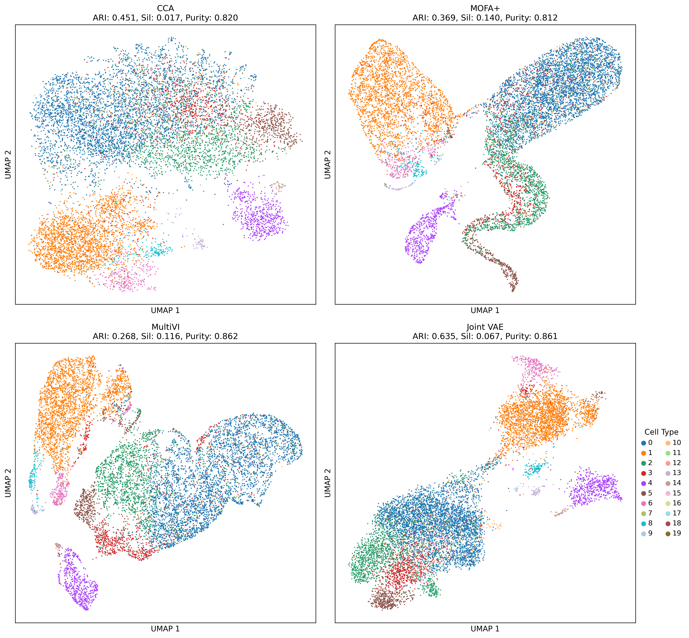
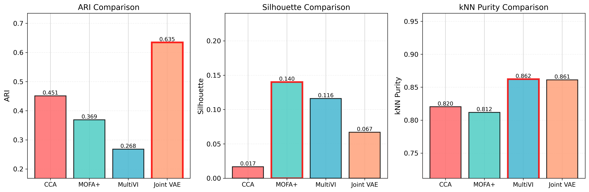
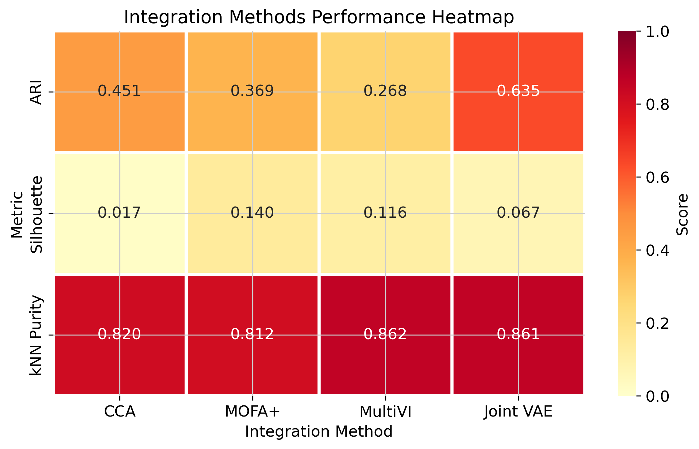

# Single-Cell Multiome Analysis: Deep Learning Integration of RNA-seq and ATAC-seq

[](https://www.python.org/downloads/release/python-3100/)
[](https://opensource.org/licenses/MIT)

A comprehensive deep learning pipeline for analyzing single-cell multiome data, benchmarking multiple state-of-the-art integration methods including CCA, Joint VAE, MultiVI, and MOFA+.

---

## Table of Contents

- [Overview](#overview)
- [Repository Structure](#repository-structure)
- [Quick Start](#quick-start)
  - [Setup Environment](#setup-environment)
  - [Run Analysis](#run-analysis)
- [Dataset](#dataset)
- [Evaluation Metrics](#evaluation-metrics)
- [Analysis Pipeline](#analysis-pipeline)
  - [1. Data Exploration](#1-data-exploration)
  - [2. Latent Modeling](#2-latent-modeling)
  - [3. Multimodal Integration](#3-multimodal-integration)
    - [Method 1: CCA](#method-1-cca-canonical-correlation-analysis)
    - [Method 2: Joint VAE](#method-2-joint-vae)
    - [Method 3: MultiVI](#method-3-multivi-scvi-tools)
    - [Method 4: MOFA+](#method-4-mofa-multi-omics-factor-analysis)
    - [Integration Methods Comparison](#integration-methods-comparison)
  - [4. Generative Modeling with Joint VAE](#4-generative-modeling-with-joint-vae)
  - [5. Biological Insights & Summary](#5-biological-insights--summary)
- [Method Selection Guide](#method-selection-guide)
- [Usage Examples](#usage-examples)
- [Deliverables](#deliverables)
- [References](#references)
- [License](#license)
- [Citation](#citation)
- [Contact](#contact)

---

## Overview

This project implements and compares state-of-the-art methods for single-cell multiome analysis on the 10x Genomics 10k PBMC dataset. The pipeline demonstrates multimodal integration of gene expression (RNA-seq) and chromatin accessibility (ATAC-seq), denoising autoencoders for dimensionality reduction, and variational autoencoders for generative modeling with comprehensive benchmarking across multiple integration approaches.

**Key Features:**
- End-to-end multiome analysis pipeline
- Four state-of-the-art integration methods benchmarked
- Generative modeling for synthetic cell generation
- Reproducible analysis with detailed documentation

---

## Repository Structure

```
.
├── multiome_analysis.ipynb                         # Main analysis notebook
├── environment.yml                                 # Conda environment specification
├── README.md                         
├── figures/
    ├── qc_umaps.png                                # Quality control visualizations
    ├── dae_umaps.png                               # DAE latent space UMAPs
    ├── integration_methods_umap_comparison.png     # 2x2 UMAP comparison
    ├── integration_methods_metrics_comparison.png  # Bar plots
    └── integration_methods_heatmap.png             # Heatmap
```

---

## Quick Start

### Setup Environment

```bash
# Clone repository
git clone https://github.com/MekanMyradov/multiome-analysis.git
cd multiome-analysis

# Create conda environment
conda env create -f environment.yml
conda activate multiome

# Or manual installation
conda create -n multiome python=3.10 -y
conda activate multiome
conda install -c conda-forge numpy pandas scipy matplotlib seaborn scikit-learn jupyter notebook h5py pytables -y
pip install --no-cache-dir scanpy anndata torch torchvision umap-learn leidenalg python-igraph scvi-tools mofapy2
```

### Run Analysis

```bash
jupyter notebook multiome_analysis.ipynb
```

---

## Dataset

**Source:** [10x Genomics - 10k Human PBMCs, Multiome v1.0, Chromium X](https://cf.10xgenomics.com/samples/cell-arc/2.0.0/10k_PBMC_Multiome_nextgem_Chromium_X/10k_PBMC_Multiome_nextgem_Chromium_X_filtered_feature_bc_matrix.h5)

| Property | Value |
|----------|-------|
| Sample | Healthy male donor (age 30-35) |
| Cells | ~10,000 PBMCs |
| Technology | Chromium Next GEM Single Cell Multiome ATAC + Gene Expression |
| RNA-seq | ~50,000 reads/cell |
| ATAC-seq | ~55,000 read pairs/cell |
| License | CC BY 4.0 |

---

## Evaluation Metrics

We evaluated all methods using three complementary clustering metrics:

| Metric | Description | Range | Interpretation |
|--------|-------------|-------|----------------|
| **Adjusted Rand Index (ARI)** | Measures agreement between K-means clustering on latent space and cell type labels. Adjusts for chance. | -1 to 1 | Higher is better. 1 = perfect agreement, 0 = random |
| **Silhouette Score** | Assesses cluster separation quality by comparing intra-cluster to nearest-cluster distance. | -1 to 1 | Higher is better. Positive = well-separated clusters |
| **kNN Purity** | Proportion of cells whose k-nearest neighbors (k=15) share the same cell type label. | 0 to 1 | Higher is better. Measures local consistency |

---

## Analysis Pipeline

### 1. Data Exploration

#### Quality Control

**RNA-seq filters:**
- Minimum 200 genes per cell
- Maximum 20% mitochondrial reads
- Genes present in at least 3 cells

**ATAC-seq filters:**
- Minimum 100 peaks per cell
- Peaks present in at least 3 cells

**Preprocessing:**
- Total count normalization (target sum: 10,000)
- Log-transformation: log(X + 1)
- Highly variable feature selection: 2,000 genes (RNA), 5,000 peaks (ATAC)
- Z-score scaling for downstream analysis
- Retained only cells present in both modalities

#### QC Summary Results

| Metric | RNA-seq | ATAC-seq |
|--------|---------|----------|
| Mean UMI counts/cell | 2,885 | 23,575 fragments |
| Median UMI counts/cell | 2,506 | 22,516 fragments |
| Mean features/cell | 1,435 genes | 8,909 peaks |
| Mean % MT reads | 8.82% | N/A |
| Cells after filtering | 10,501 | 10,501 |


**Figure 1: Quality Control UMAP Visualizations.** RNA-seq (left) and ATAC-seq (right) modalities colored by cell type. Leiden clustering (resolution 0.5) was used to define cell types in the absence of ground-truth labels.

**Key Observations:**
- Successfully retained 10,501 high-quality cells after filtering
- ATAC-seq clusters appear less sharply separated than RNA-seq due to higher sparsity (~5% vs 10-15% non-zero values)

---

### 2. Latent Modeling

#### Denoising Autoencoders (DAE)

We implemented denoising autoencoders for nonlinear dimensionality reduction of both RNA and ATAC modalities.

**Architecture:**
```
Input → 1024 (BN, ReLU, Dropout 0.1) 
      → 512 (BN, ReLU, Dropout 0.1) 
      → 32 (latent space)
      → 512 (BN, ReLU) 
      → 1024 (BN, ReLU) 
      → Output
```

**Training Configuration:**
- Latent dimensions: 32 (within 16-32 range requirement)
- Noise factor: 0.15 (Gaussian noise for denoising)
- Optimizer: Adam (learning rate: 0.0005)
- Batch size: 256
- Epochs: 100
- Loss function: Mean Squared Error (MSE)

**Training Details:**
- Gaussian noise added to inputs during training for robustness
- Batch normalization layers for stable training
- Dropout (0.1) for regularization
- Separate models trained for RNA and ATAC modalities

#### Performance Comparison

| Method | ARI | Silhouette | kNN Purity |
|--------|-----|------------|------------|
| RNA-PCA | **0.65** | **0.20** | **0.95** |
| RNA-DAE | 0.50 | -0.07 | 0.81 |
| ATAC-PCA | **0.47** | **0.00** | **0.79** |
| ATAC-DAE | 0.35 | -0.07 | 0.79 |


**Figure 2: DAE Latent Space Visualizations.** UMAP projections of 32-dimensional DAE latent representations for RNA-seq (left) and ATAC-seq (right) modalities.

**Key Observations:**
- DAE achieved lower performance than PCA baseline on this clean, well-separated PBMC dataset
- PCA is a strong baseline for datasets with clear cell type separation
- DAE provides nonlinear feature learning capability, which becomes more valuable in:
  - Noisy or complex datasets
  - Transfer learning scenarios
  - When generative capability is needed

---

### 3. Multimodal Integration

We implemented and benchmarked four integration methods, each with distinct strengths and trade-offs.

---

#### Method 1: CCA (Canonical Correlation Analysis)

**Approach:** Linear method that finds projections maximizing correlation between modalities.

**Methodology:**
```
Input: Z_RNA (10,501 × 32), Z_ATAC (10,501 × 32) from DAE
Objective: max corr(Z_RNA · W_RNA, Z_ATAC · W_ATAC)
Output: 20 canonical components per modality
Joint representation: Concatenate → (10,501 × 40)
```

**Integration Process:**
1. Extract 32-dimensional latent representations from trained DAE models
2. Apply CCA to find 20 canonical components maximizing cross-modal correlation
3. Concatenate RNA_CCA and ATAC_CCA to form 40-dimensional joint representation
4. Compute UMAP and evaluate clustering metrics

**Advantages:**
- Fast and computationally efficient
- Highly interpretable (linear transformations)
- Works well as baseline method
- No hyperparameter tuning required

**Limitations:**
- Linear assumptions may miss nonlinear relationships
- No generative capability

---

#### Method 2: Joint VAE

**Approach:** Variational autoencoder with shared encoder for unified multimodal representation.

**Architecture:**
```
Concatenate: [X_RNA; X_ATAC] → X_joint (7,000 features total)
               ↓
Shared Encoder: X_joint → 1024 → 512 → 256 → 128 → (μ, σ²)
               ↓
Latent Space: Z ~ N(μ, σ²) (32 dimensions)
               ↓
RNA Decoder: Z → 128 → 256 → 512 → X'_RNA (2,000 genes)
ATAC Decoder: Z → 128 → 256 → 512 → X'_ATAC (5,000 peaks)
```

**Key Features:**
- Forces unified representation from the start (early fusion)
- More parameter efficient than separate encoders
- Better for cross-modal prediction
- Enables paired RNA+ATAC generation from latent space

**Training Configuration:**
- Latent dimensions: 32
- Loss: MSE(RNA) + MSE(ATAC) + β·KL(q(Z|X)||N(0,1))
  - β = 0.001 (balances reconstruction quality vs latent space regularization)
- Optimizer: Adam (learning rate: 0.0001)
- Batch size: 256
- Epochs: 100
- Xavier initialization for stable training
- Gradient clipping (max_norm=1.0)

**Generative Capability:**
```python
# Generate paired RNA+ATAC synthetic cells
z = torch.randn(100, 32)  # Sample from N(0,1)
rna_synthetic, atac_synthetic = model.decode(z)
```

**Advantages:**
- Generates paired multimodal synthetic data
- Probabilistic framework with uncertainty quantification
- Strong integration through forced shared latent space

**Limitations:**
- Requires careful tuning of β parameter
- Training can be unstable without proper initialization
- More computationally expensive than linear methods

---

#### Method 3: MultiVI (scVI-tools)

**Approach:** Deep generative model from the scVI-tools ecosystem designed specifically for multimodal integration.

**Architecture:**
- Probabilistic generative model with variational inference
- Handles batch effects and technical variation
- Built on proven scVI foundations

**Training Configuration:**
- Latent dimensions: 8 (default)
- Batch size: 128
- Optimizer: Adam (learning rate: 0.0001)
- Max epochs: 500 (with early stopping)
- Automatic convergence detection

**Advantages:**
- State-of-the-art deep learning approach
- Robust handling of complex batch effects
- Part of well-maintained scVI-tools ecosystem
- Active development and community support

**Limitations:**
- More complex setup and data formatting requirements
- Less interpretable than statistical methods
- Requires more computational resources

---

#### Method 4: MOFA+ (Multi-Omics Factor Analysis)

**Approach:** Statistical framework using probabilistic factor analysis to identify interpretable latent factors.

**Methodology:**
```
Learn K factors capturing variation sources:
- Z (cells × K factors): Factor values per cell
- W_RNA (genes × K): Gene weights per factor
- W_ATAC (peaks × K): Peak weights per factor

Variance decomposition:
- Shared factors (both modalities)
- RNA-specific factors
- ATAC-specific factors
```

**Key Features:**
- Identifies shared vs. modality-specific variation
- Variance decomposition across modalities
- Automatic Relevance Determination (ARD) for factor selection
- Feature weights enable biological interpretation

**Training Configuration:**
- Number of factors: 10 (automatically selected via ARD)
- Convergence mode: Fast
- Max iterations: 1,000
- Likelihood: Gaussian for both modalities

**Advantages:**
- Highly interpretable results
- Identifies specific biological drivers
- Quantitative variance decomposition
- Works well on smaller datasets
- Statistical rigor with uncertainty quantification

**Limitations:**
- Linear model assumptions
- Less scalable than deep learning methods
- No generative capability
- Requires centered data

---

### Integration Methods Comparison



**Figure 3: Comprehensive Integration Benchmark.** 2×2 grid of UMAP visualizations for all four integration methods with performance metrics displayed in titles.

#### Quantitative Comparison

| Method | ARI ↑ | Silhouette ↑ | kNN Purity ↑ |
|--------|-------|--------------|--------------|
| **Joint VAE** | **0.63** | 0.07 | **0.86** |
| CCA | 0.45 | 0.02 | 0.82 |
| **MOFA+** | 0.37 | **0.14** | 0.81 |
| MultiVI | 0.27 | 0.12 | **0.86** |

**Key Findings:**
- **Joint VAE** achieved best overall performance with highest ARI (0.63) and tied best kNN Purity (0.86)
- **MOFA+** showed best cluster separation with highest Silhouette score (0.14)
- **MultiVI** matched Joint VAE in kNN Purity (0.86) but had lower ARI
- **CCA** provided competitive baseline with moderate performance across all metrics



**Figure 4: Quantitative Metrics Comparison.** Bar plots comparing all methods across three evaluation metrics. Red borders highlight best performers.



**Figure 5: Performance Heatmap.** Color-coded comparison showing strengths and weaknesses of each method across metrics.

---

### 4. Generative Modeling with Joint VAE

The Joint VAE with shared encoder enables generation of paired RNA+ATAC synthetic cells.

**Generative Process:**
1. **Sample latent code** from prior distribution: Z ~ N(0, 1)
2. **Decode to both modalities**: (RNA', ATAC') = Decoder(Z)
3. **Result**: Paired synthetic cells with realistic expression patterns

**Why This Works:**
During training, the KL divergence term forces the latent distribution to match N(0,1). This means:
- Any point sampled from N(0,1) should decode to a plausible cell
- Points near T cell cluster → T cell-like expression patterns
- Points near B cell cluster → B cell-like expression patterns
- Smooth interpolation between cell types is possible

**Example Usage:**
```python
model.eval()

# generate synthetic cells
with torch.no_grad():
    z = torch.randn(100, 32)  # sample 100 cells from prior
    rna_synthetic, atac_synthetic = model.decode(z)

print(f"Generated RNA: {rna_synthetic.shape}")    # (100, 2000)
print(f"Generated ATAC: {atac_synthetic.shape}")  # (100, 5000)
```

**Generated Synthetic Cells:**
- Shape: (100, 2000) RNA + (100, 5000) ATAC
- Realistic expression patterns matching real data distribution
- Captures cell type diversity from training data

---

### 5. Biological Insights & Summary

#### Key Findings

1. **Data Quality**: Successfully processed 10,501 high-quality PBMC cells with paired RNA and ATAC measurements.

2. **Method Comparison**: Benchmarked four integration methods with distinct strengths:
   - **Joint VAE**: Best overall integration quality (ARI: 0.63) with generative capability
   - **MOFA+**: Superior interpretability and variance decomposition (Silhouette: 0.14)
   - **CCA**: Fast, interpretable baseline (ARI: 0.45)
   - **MultiVI**: Strong local consistency (kNN Purity: 0.86)

3. **Generative Modeling**: Joint VAE's shared encoder architecture enables paired RNA+ATAC synthetic cell generation while maintaining high integration quality.

4. **Sparsity Effects**: ATAC-seq data showed expected lower cluster separation due to inherent sparsity (~5% vs 10-15% non-zero values for RNA-seq).

#### Limitations

1. **Cell Type Validation**: Labels derived from unsupervised Leiden clustering rather than validated marker genes. Future work should include differential expression analysis and marker-based annotation (CD3D for T cells, CD79A for B cells, CD14 for monocytes, etc.).

2. **Single Sample Analysis**: Dataset from one healthy donor without batch effects. Multi-sample integration needed to assess:
   - Generalizability across individuals
   - Batch correction capabilities
   - Robustness to technical variation

3. **Linear Method Assumptions**: CCA and MOFA+ assume linear relationships, potentially missing complex nonlinear interactions between modalities.

4. **Computational Cost**: Deep learning methods (Joint VAE, MultiVI) require more computational resources and longer training times compared to linear methods.

5. **Parameter Sensitivity**: Each method has hyperparameters requiring careful tuning:
   - Joint VAE: β parameter for KL divergence weighting
   - MOFA+: Number of factors
   - MultiVI: Latent dimensions, early stopping criteria

6. **DAE Baseline**: DAE underperformed PCA on this clean dataset, suggesting linear methods suffice for well-separated data. Deep learning advantages emerge with:
   - Complex, noisy datasets
   - Batch effect correction
   - Transfer learning scenarios

#### Future Directions

1. Validate cell type assignments using canonical marker genes
2. Apply to multi-donor cohorts with proper batch correction
3. Implement hyperparameter optimization for each method
4. Extend to larger datasets (>100k cells)

---

## Method Selection Guide

Choose the appropriate integration method based on your specific needs:

### Choose **CCA** when:
- Need fast, simple baseline results
- Linear relationships are sufficient
- Interpretability is more important than performance
- Limited computational resources
- No generative modeling needed

### Choose **Joint VAE** when:
- Need generative capability for synthetic data
- Want paired multimodal generation
- Nonlinear integration is beneficial
- Have computational resources for training
- Performance is priority

### Choose **MultiVI** when:
- Have batch effects to correct
- Part of existing scVI-tools workflow
- Need state-of-the-art deep learning
- Handle missing modalities
- Active community support important

### Choose **MOFA+** when:
- Interpretability is top priority
- Want variance decomposition across modalities
- Need to identify biological drivers
- Working with smaller datasets
- Statistical rigor required

---

## References

1. 10x Genomics. 10k Human PBMCs, Multiome v1.0, Chromium X. https://www.10xgenomics.com/datasets

2. Wolf, F.A., Angerer, P. & Theis, F.J. SCANPY: large-scale single-cell gene expression data analysis. *Genome Biology* **19**, 15 (2018).

3. Kingma, D.P. & Welling, M. Auto-Encoding Variational Bayes. *ICLR* (2014).

4. Lopez, R. et al. Deep generative modeling for single-cell transcriptomics. *Nature Methods* **15**, 1053–1058 (2018).

5. Ashuach, T. et al. MultiVI: deep generative model for the integration of multimodal data. *Nature Methods* **20**, 1222–1231 (2023).

6. Argelaguet, R. et al. MOFA+: a statistical framework for comprehensive integration of multi-modal single-cell data. *Genome Biology* **21**, 111 (2020).

---

## License

This project is licensed under the MIT License. The 10x Genomics dataset is licensed under CC BY 4.0.

---

## Citation

If you use this code or methods in your research, please cite:

```bibtex
@software{multiome_analysis,
  author = {Mekan Myradov},
  title = {Single-Cell Multiome Analysis: Benchmarking Integration Methods},
  year = {2025},
  url = {https://github.com/MekanMyradov/multiome-analysis}
}
```

---

## Contact

For questions or issues, please open a GitHub issue or contact the repository owner.
