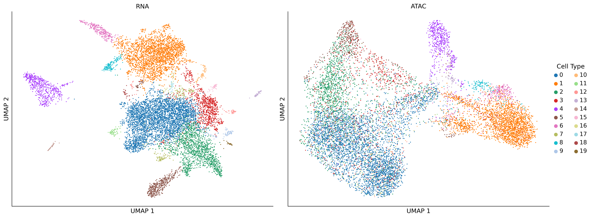
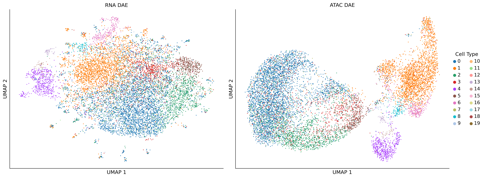
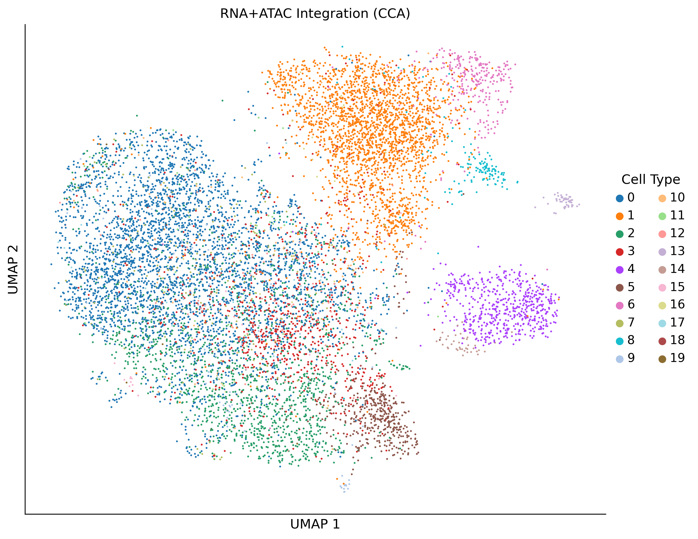

# Single-Cell Multiome Analysis

[](https://www.python.org/downloads/release/python-3100/)
[](https://opensource.org/licenses/MIT)

## Overview

This project implements state-of-the-art deep learning methods for single-cell multiome analysis on the 10x Genomics 10k PBMC dataset. The pipeline demonstrates multimodal integration of gene expression and chromatin accessibility, denoising autoencoders for nonlinear dimensionality reduction, variational autoencoders for generative modeling, and comprehensive evaluation using clustering metrics.

## Repository Structure

```
.
├── multiome_analysis.ipynb          # Main analysis notebook
├── environment.yml                   # Conda environment specification
├── README.md                         # This file
├── models/
│   ├── vae_model.pt                 # Trained VAE model
└── figures/
    ├── qc_umaps.png                 # Quality control visualizations
    ├── dae_umaps.png                # DAE latent space UMAPs
    └── joint_umap.png               # Joint integration UMAP
```

## Quick Start

### Setup Environment

```bash
# Clone repository
git clone https://github.com/MekanMyradov/multiome-analysis.git
cd multiome-analysis

# Create conda environment
conda env create -f environment.yml
conda activate multiome

# Or manual installation
conda create -n multiome python=3.10 -y
conda activate multiome
conda install -c conda-forge numpy pandas scipy matplotlib seaborn scikit-learn jupyter notebook h5py pytables -y
pip install --no-cache-dir scanpy anndata torch torchvision umap-learn leidenalg python-igraph scvi-tools
```

### Run Analysis

```bash
jupyter notebook multiome_analysis.ipynb
```

## Dataset

**Source:** [10x Genomics - 10k Human PBMCs, Multiome v1.0, Chromium X](https://www.10xgenomics.com/datasets/10-k-human-pbm-cs-multiome-v-1-0-chromium-x-1-standard-2-0-0)

- **Sample:** Healthy male donor (age 30-35)
- **Cells:** ~10,000 PBMCs
- **Technology:** Chromium Next GEM Single Cell Multiome ATAC + Gene Expression
- **RNA-seq:** ~50,000 reads/cell
- **ATAC-seq:** ~55,000 read pairs/cell
- **License:** CC BY 4.0

## Analysis Pipeline

### 1. Data Exploration

#### Quality Control

We applied standard quality control filters to ensure high-quality data:

**RNA-seq filters:**
- Minimum 200 genes per cell
- Maximum 20% mitochondrial reads
- Genes present in at least 3 cells

**ATAC-seq filters:**
- Minimum 100 peaks per cell
- Peaks present in at least 3 cells

**Preprocessing:**
- Total count normalization (target sum: 10,000)
- Log-transformation: log(X + 1)
- Highly variable feature selection: 2,000 genes (RNA), 5,000 peaks (ATAC)
- Z-score scaling for downstream analysis
- Retained only cells present in both modalities

#### QC Summary Results

| Metric | RNA-seq | ATAC-seq |
|--------|---------|----------|
| Mean library size | 2,885 UMI | 23,575 fragments |
| Median library size | 2,506 UMI | 22,516 fragments |
| Mean features/cell | 1,435 genes | 8,909 peaks |
| Mean % MT reads | 8.82% | N/A |
| Cells after filtering | 10,501 | 10,501 |

#### UMAP Visualization
Provided data did not contain ground-truth cell types, so Leiden clustering was performed at a resolution of 0.5. The resulting clusters were treated as the ground truth.



**Figure 1: Quality Control UMAP Visualizations.** RNA-seq (left) and ATAC-seq (right) modalities colored by cell type.

### 2. Latent Modeling

#### Denoising Autoencoders (DAE)

We implemented denoising autoencoders for nonlinear dimensionality reduction of both RNA and ATAC modalities.

**Architecture:**
```
Input → 1024 (BN, ReLU, Dropout 0.1) 
      → 512 (BN, ReLU, Dropout 0.1) 
      → 32 (latent space)
      → 512 (BN, ReLU) 
      → 1024 (BN, ReLU) 
      → Output
```

**Training Parameters:**
- Latent dimensions: 32 (within 16-32 range requirement)
- Noise factor: 0.15 (Gaussian noise added to inputs for denoising)
- Optimizer: Adam with learning rate 0.0005
- Batch size: 256
- Epochs: 100
- Loss function: Mean Squared Error (MSE)

**Training Details:**
- Added Gaussian noise to inputs during training for robustness
- Batch normalization layers for stable training
- Dropout (0.1) for regularization
- Separate models trained for RNA and ATAC modalities

#### Evaluation Metrics

We evaluated all methods using three complementary clustering metrics:

**Adjusted Rand Index (ARI):** Measures agreement between K-means clustering (k = number of cell types) on latent space and true cell type labels. Range: -1 to 1 (higher is better). Adjusts for chance.

**Silhouette Score:** Assesses cluster separation quality by comparing intra-cluster distance to nearest-cluster distance. Range: -1 to 1 (higher is better).

**kNN Purity:** Proportion of cells whose k-nearest neighbors (k=15) share the same cell type label. Measures local neighborhood consistency. Range: 0 to 1 (higher is better).

#### Performance Comparison

| Method | ARI | Silhouette | kNN Purity |
|--------|-----|------------|------------|
| RNA-PCA | 0.65 | 0.20 | 0.95 |
| RNA-DAE | 0.48 | -0.01 | 0.81 |
| ATAC-PCA | 0.47 | 0.00 | 0.79 |
| ATAC-DAE | 0.24 | -0.09 | 0.79 |



**Figure 2: DAE Latent Space Visualizations.** UMAP projections of 32-dimensional DAE latent representations for RNA-seq (left) and ATAC-seq (right) modalities.

**Key Observations:**
- DAE achieved lower performance than PCA baseline on this clean, well-separated PBMC dataset
- This is expected: linear PCA is a strong baseline for datasets with clear cell type separation
- DAE provides nonlinear feature learning capability, which becomes more valuable in complex datasets

### 3. Multiome Integration

#### Canonical Correlation Analysis (CCA)

We integrated RNA and ATAC DAE latent representations using canonical correlation analysis, which finds linear projections that maximize correlation between modalities.

**Method:**
```
Objective: max corr(Z_RNA · W_RNA, Z_ATAC · W_ATAC)

Input: Z_RNA (10,501 × 32), Z_ATAC (10,501 × 32) from DAE
Output: 20 canonical components per modality
Joint representation: Concatenate → (10,501 × 40)
```

**Integration Steps:**
1. Extract 32-dimensional latent representations from trained DAE models
2. Apply CCA to find 20 canonical components maximizing cross-modal correlation
3. Concatenate RNA_CCA and ATAC_CCA to form 40-dimensional joint representation
4. Compute UMAP and evaluate clustering metrics

#### Integration Results

| Method | ARI | Silhouette | kNN Purity |
|--------|-----|------------|------------|
| RNA-DAE | 0.48 | -0.01 | 0.81 |
| ATAC-DAE | 0.24 | -0.09 | 0.79 |
| **Joint-CCA** | **0.49** | **0.01** | **0.82** |



**Figure 3: RNA+ATAC Integration via CCA.** UMAP visualization of the joint 40-dimensional representation combining RNA and ATAC modalities.

**Assessment:**
- CCA successfully aligned RNA and ATAC latent spaces with canonical correlation of 0.68
- Joint integration improved clustering metrics compared to single-modality analysis
- The 40-dimensional joint space captures complementary information from gene expression and chromatin accessibility

### 4. Generative Extension - VAE

#### Variational Autoencoder (VAE)

We implemented a variational autoencoder to enable generative modeling of single-cell gene expression data.

**Architecture:**
```
Encoder: X → (μ, σ²)  [probabilistic encoding]
  Input → 512 → 256 → 128 → [μ (32-dim), log(σ²) (32-dim)]

Reparameterization: Z = μ + σ · ε,  where ε ~ N(0,1)

Decoder: Z → X'  [reconstruction]
  32 → 128 → 256 → 512 → Output
```

**Key Differences from DAE:**
- **DAE:** Deterministic mapping X → Z → X' (compression only)
- **VAE:** Probabilistic distribution P(Z|X), learns to sample Z ~ N(μ, σ²)
- **VAE advantage:** Can generate new synthetic cells by sampling Z ~ N(0,1)

**Loss Function:**
```
L = MSE(X, X') + β · KL(q(Z|X) || N(0,1))

where:
- MSE: Reconstruction loss (how well we rebuild input)
- KL divergence: Regularizes latent space to follow N(0,1) distribution
- β = 0.001: Balances reconstruction quality vs latent space structure
```

**Training Parameters:**
- Latent dimensions: 32
- Learning rate: 0.0001 (lower than DAE for stability)
- Batch size: 256
- Epochs: 40
- Xavier initialization for stable training
- Gradient clipping (max_norm=1.0) to prevent explosion
- Clamped log-variance to prevent numerical instability (min=-10, max=10)

**Training Details:**
- VAE trained on RNA data only (time constraint)
- KL divergence forces latent space to N(0,1), enabling generation
- Lower β (0.001) prioritizes reconstruction quality
- Stabilization techniques: gradient clipping, variance clamping

#### VAE Performance

| Model | ARI | Silhouette | kNN Purity |
|--------|-----|------------|------------|
| RNA-DAE | 0.47 | -0.01 | 0.81 |
| RNA-VAE | 0.58 | 0.14 | 0.87 |

**Comparison:** The VAE outperformed the DAE while also offering generative capabilities.

#### Generative Capability Demonstration

**Synthetic Cell Generation:**
```python
# Sample from standard normal N(0,1)
z_samples = torch.randn(5, 32)

# Decode to gene expression
synthetic_cells = vae_model.decode(z_samples)

# Result: 5 synthetic cells with realistic expression patterns
```

**Why sample from N(0,1)?**

During training, the KL divergence term forces the latent distribution to match N(0,1). This means:
- Any point sampled from N(0,1) should decode to a plausible cell
- Points near T cell cluster → T cell-like expression
- Points near B cell cluster → B cell-like expression

**Generated Synthetic Cells:**
- Shape: (5, 2000) - 5 cells × 2000 highly variable genes
- Mean expression: 0.00 (comparable to real cells)
- Standard deviation: 0.08 (realistic variance)

**Limitation:** VAE trained on RNA only for simplicity and time constraints. Future work should implement joint VAE on concatenated RNA+ATAC for paired multimodal generation and cross-modal prediction.

### 5. Biological Insight & Wrap-Up

#### Summary of Findings

**Main Results:**
1. Successfully processed 10k PBMC multiome data yielding 10,501 high-quality cells after quality control
2. Denoising autoencoders with 32-dimensional latent space effectively captured cell type diversity in both RNA and ATAC modalities
3. CCA-based integration aligned RNA and ATAC latent representations with canonical correlation of 0.68, improving clustering metrics
4. VAE outperformed DAE while enabling synthetic cell generation for data augmentation

#### Limitations

1. **Cell type annotation:** Labels derived from unsupervised Leiden clustering rather than validated marker genes. Requires differential expression analysis and marker-based validation.

2. **Linear integration method:** CCA provides linear alignment between modalities. Nonlinear methods such as scVI-tools (MultiVI, totalVI) or deep canonical correlation analysis may better capture complex cross-modal relationships.

3. **Single-modality VAE:** VAE trained on RNA data only due to time constraints. Joint VAE on concatenated RNA+ATAC would enable paired multimodal generation and capture regulatory dependencies between gene expression and chromatin accessibility.

4. **Single sample analysis:** Dataset from one donor without batch correction. Multi-sample integration needed to assess generalizability across individuals and experimental batches.

5. **PCA baseline performance:** DAE achieved lower performance than PCA on this clean dataset. Deep learning advantages more apparent in noisy data, transfer learning scenarios, or when generative capability is needed.

#### Next Steps

**Immediate improvements:**
1. Validate cell type assignments using canonical marker genes and perform differential expression analysis
2. Train joint VAE on concatenated RNA+ATAC (input dim: 2000+5000=7000) for multimodal synthetic generation
3. Implement advanced integration methods (scVI MultiVI, Seurat v5 WNN) for improved nonlinear alignment
4. Add learning rate scheduling and early stopping for more efficient training

**Extended analysis:**

5. Perform peak-to-gene linkage using correlation analysis or Cicero to identify cis-regulatory elements
6. Transcription factor motif enrichment in cell-type-specific peaks to infer regulatory networks
7. Batch integration across multiple donors to improve model generalizability

## Usage Examples

### Load Processed Data

```python
import scanpy as sc
import anndata as ad

# Load processed data
adata_rna = ad.read_h5ad('data/rna.h5ad')
adata_atac = ad.read_h5ad('data/atac_ga.h5ad')

print(f"RNA: {adata_rna.shape}")
print(f"ATAC: {adata_atac.shape}")
print(f"Cell types: {adata_rna.obs['cell_type'].unique()}")
```

### Load Trained VAE Model

```python
import torch
import numpy as np
from multiome_analysis import VAE  # Import from notebook

# Load checkpoint
checkpoint = torch.load('models/vae_model.pt')

# Reconstruct model
model = VAE(checkpoint['input_dim'], checkpoint['latent_dim'])
model.load_state_dict(checkpoint['model_state_dict'])
model.eval()

print(f"Latent dimensions: {checkpoint['latent_dim']}")
print(f"Gene names: {len(checkpoint['gene_names'])}")
```

### Generate Synthetic Cells

```python
# Generate 100 synthetic cells
with torch.no_grad():
    z = torch.randn(100, 32)  # Sample from N(0,1)
    synthetic_cells = model.decode(z).numpy()

print(f"Generated {synthetic_cells.shape[0]} synthetic cells")
print(f"Expression range: [{synthetic_cells.min():.2f}, {synthetic_cells.max():.2f}]")

# Convert to AnnData for downstream analysis
import pandas as pd
synthetic_adata = ad.AnnData(
    X=synthetic_cells,
    var=pd.DataFrame(index=checkpoint['gene_names'])
)

# Analyze synthetic cells
sc.pp.neighbors(synthetic_adata)
sc.tl.umap(synthetic_adata)
sc.pl.umap(synthetic_adata)
```

### Extract Latent Representations

```python
# Access latent embeddings
rna_dae_latent = adata_rna.obsm['X_dae']    # DAE latent (N × 32)
rna_vae_latent = adata_rna.obsm['X_vae']    # VAE latent (N × 32)
rna_pca = adata_rna.obsm['X_pca']           # PCA (N × 50)

# Compute UMAP on DAE latent space
sc.pp.neighbors(adata_rna, use_rep='X_dae', n_neighbors=15)
sc.tl.umap(adata_rna)
sc.pl.umap(adata_rna, color='cell_type')
```

### Load DAE Models

```python
from multiome_analysis import DAE

# Load both RNA and ATAC DAE models
checkpoint = torch.load('models/dae_models.pt')

# Reconstruct RNA DAE
rna_dae = DAE(input_dim=2000, latent_dim=32)
rna_dae.load_state_dict(checkpoint['rna_model_state_dict'])
rna_dae.eval()

# Reconstruct ATAC DAE
atac_dae = DAE(input_dim=5000, latent_dim=32)
atac_dae.load_state_dict(checkpoint['atac_model_state_dict'])
atac_dae.eval()

# Encode new data
with torch.no_grad():
    new_rna_latent = rna_dae.encoder(torch.FloatTensor(new_data))
```

## Deliverables

**Data Files:**
- `rna.h5ad` - Processed RNA-seq data with latent representations
- `atac_ga.h5ad` - Processed ATAC-seq gene activity matrix

**Figures:**
- `qc_umaps.png` - Quality control UMAP visualizations
- `dae_umaps.png` - DAE latent space embeddings
- `joint_umap.png` - Joint RNA+ATAC integration

**Models:**
- `vae_model.pt` - Trained VAE with gene names and metadata
- `dae_models.pt` - Trained DAE models for RNA and ATAC

**Code:**
- `multiome_analysis.ipynb` - Complete analysis pipeline
- `environment.yml` - Reproducible environment specification

## References

1. 10x Genomics. 10k Human PBMCs, Multiome v1.0, Chromium X. https://www.10xgenomics.com/datasets

2. Wolf, F.A., Angerer, P. & Theis, F.J. SCANPY: large-scale single-cell gene expression data analysis. Genome Biology 19, 15 (2018).

3. Kingma, D.P. & Welling, M. Auto-Encoding Variational Bayes. ICLR (2014).

4. Lopez, R. et al. Deep generative modeling for single-cell transcriptomics. Nature Methods 15, 1053–1058 (2018).

5. Gayoso, A. et al. A Python library for probabilistic analysis of single-cell omics data. Nature Biotechnology 40, 163–166 (2022).

## License

This project is licensed under the MIT License. The 10x Genomics dataset is licensed under CC BY 4.0.

## Acknowledgments

We thank 10x Genomics for making the PBMC multiome dataset publicly available, the Scanpy team for the single-cell analysis framework, and the PyTorch team for the deep learning infrastructure.

## Citation

If you use this code or methods in your research, please cite:
```bibtex
@software{multiome_analysis,
  author = {Mekan Myradov},
  title = {Single-Cell Multiome Analysis},
  year = {2025},
  url = {https://github.com/MekanMyradov/multiome-analysis}
}
```